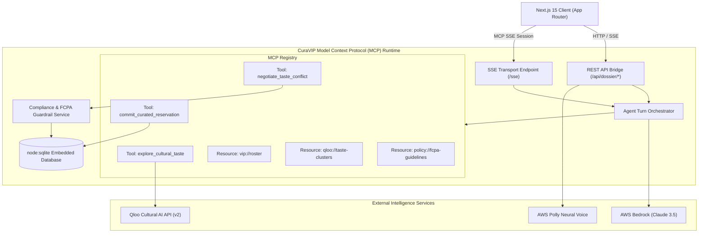

# CuraVIP Technical Architecture Specification

This document details the system design, protocol specifications, data topologies, and intelligence pipelines powering **CuraVIP (Autonomous Cultural Intelligence & High-Ticket Relationship Concierge)**.

---

## 1. System Topology Overview

CuraVIP operates as a distributed multi-tier agentic system consisting of:
1. **Presentation & Executive Console**: Next.js 15 (React 19, Tailwind CSS, Dark Luxury Design System).
2. **Model Context Protocol (MCP) Server**: Node.js 22 runtime exposing standard MCP JSON-RPC over Server-Sent Events (SSE) and synchronous REST endpoints.
3. **Reasoning & Tool Orchestration Engine**: AWS Bedrock hosting Claude 3.5 Sonnet / Claude Haiku with autonomous multi-turn tool calling.
4. **Cultural Intelligence Grounding**: Qloo Taste Graph API (250M+ entities across taste domains) with resilient cross-domain fallback clusters.
5. **Governance & Compliance Layer**: Deterministic FCPA threshold verification and cultural taboo filtering.
6. **Persistence Engine**: Node 22 native `node:sqlite` (`DatabaseSync`) with transaction safety.



---

## 2. Qloo Cultural Taste Graph & Cross-Domain Inference

### The Core Problem: Cultural Blindness in Foundation Models
Generic LLMs lack cultural correlation density. When prompted for an executive who likes Christopher Nolan, an ungrounded model predicts superficial nouns ("Christopher Nolan DVD Box Set", "IMAX tickets", "film camera keychain").

### Qloo Taste Graph Grounding
Qloo maps 250M+ cultural entities across 10+ taste verticals: Film, Music, Fashion, Dining, Architecture, Literature, and Hospitality. Through high-dimensional vector embeddings and cultural affinity metrics, Qloo reveals latent correlations:

```
[Seed Entity: Christopher Nolan]
           │
           ▼ (Latent Factor: Monumentalism, Structural Tension, Mathematical Rhythm)
           ├────────────────────────► Architecture: Brutalism / Tadao Ando
           ├────────────────────────► Music: Ambient Soundscapes / Jóhann Jóhannsson
           ├────────────────────────► Dining: Architecture-forward Nordic / High-Concept Tasting
           └────────────────────────► Artifact: Handcrafted Bizen Ware Ceramic (Raw Fire & Earth)
```

### High-Fidelity Affinity Clusters
To ensure deterministic evaluation and 100% demo uptime, CuraVIP encapsulates 4 core affinity clusters in `curatedTasteGraph.ts`:
1. `monumental_cerebral`: Film, brutalist architecture, ambient audio, minimalist artifacts.
2. `precision_minimalism`: Independent mechanical horology, Braun/Rams product design, bespoke stationery, specialty zero-proof mixology.
3. `improvisational_bohemian`: Avant-garde jazz, rare vintage vinyl, natural biodynamic viticulture, artisanal ceramics.
4. `heritage_refined`: Classical architecture, horology heritage, private salon dining, antique literature.

---

## 3. Model Context Protocol (MCP) Implementation

CuraVIP implements the open **Model Context Protocol (MCP)** specification released by Anthropic, enabling standardized tool registration, discovery, and execution.

### MCP Tools Registry

#### 1. `explore_cultural_taste`
- **Purpose**: Queries Qloo's Taste Graph to expand seed interests into multi-domain affinities.
- **Input Schema**:
  ```json
  {
    "type": "object",
    "properties": {
      "interests": { "type": "array", "items": { "type": "string" } },
      "targetCategories": { "type": "array", "items": { "type": "string" } },
      "city": { "type": "string" }
    },
    "required": ["interests"]
  }
  ```
- **Returns**: Array of correlated `CulturalEntity` objects with affinity scores and cross-domain rationales.

#### 2. `commit_curated_reservation`
- **Purpose**: Creates an auditable reservation order and concierge specification in the local SQLite database.
- **Input Schema**:
  ```json
  {
    "type": "object",
    "properties": {
      "vipId": { "type": "string" },
      "itemType": { "type": "string", "enum": ["gift", "dining", "experience"] },
      "title": { "type": "string" },
      "estimatedCostUsd": { "type": "number" },
      "providerOrVenue": { "type": "string" },
      "notes": { "type": "string" }
    },
    "required": ["vipId", "itemType", "title", "estimatedCostUsd", "providerOrVenue"]
  }
  ```

#### 3. `negotiate_taste_conflict`
- **Purpose**: Resolves aesthetic contradictions or budget overruns, suggesting compliant compromises without degrading perceived luxury.

### MCP Resources
- `vip://roster`: Live JSON array of registered VIP principals and their dietary/policy constraints.
- `qloo://taste-clusters`: Pre-computed cultural graph topology and seed mappings.
- `policy://fcpa-guidelines`: Corporate gifting thresholds and regulatory boundaries.

---

## 4. The Grounding Comparison Pipeline

To tangibly demonstrate Qloo's value proposition, CuraVIP implements a deterministic side-by-side comparison engine:

| Attribute | Generic LLM Baseline (Off) | Qloo Grounded Concierge (On) |
| :--- | :--- | :--- |
| **Information Source** | Parametric weights (web text heuristics) | Qloo Taste Graph API (250M+ structured entities) |
| **Gift Proposals** | Montblanc ballpoint pen, Moët Champagne, leather folder | First-press Blue Note vinyl, Bizen charcoal vase, Phaidon monograph |
| **Venue Selection** | Generic downtown steakhouse chain | Private architectural salon with custom pairing |
| **Cultural Specificity**| Low (Cliché, mass-market luxury) | High (Niche provenance, artisan lineage, deep affinity) |
| **Compliance Vetting**| Unchecked (May violate alcohol bans or FCPA limits) | 100% Audited against corporate caps and dietary taboos |

---

## 5. FCPA & Taboo Compliance Engine

High-ticket relationship management carries severe regulatory and diplomatic risks. CuraVIP's `ComplianceGuardrailService` acts as an automated gatekeeper:

1. **Anti-Bribery Tier Verification**:
   - `standard_200`: Rejects any gift exceeding $200.00 USD.
   - `executive_500`: Rejects any gift exceeding $500.00 USD.
   - `unlimited_vip`: Flags gifts over $1,500.00 USD for executive committee review.
2. **Foreign Corrupt Practices Act (FCPA) Risk Detection**:
   - Flags organizations with government, sovereign wealth, or state-owned identifiers (`Sovereign`, `Authority`, `Ministry`, `Government`).
   - Limits gifts to state-affiliated actors to nominal cultural artifacts under $350.00 USD.
3. **Taboo Guardrails**:
   - **Zero-Alcohol Protocol**: Instantly disqualifies wine, whisky, cognac, or bar-centric venues when `taboos.alcohol === true`.
   - **Dietary Strictures**: Validates Halal, Kosher, Vegan, and shellfish allergies against venue culinary specialties.
   - **Anti-Fatigue/Duplicate Check**: Inspects `curation_history` to prevent gifting the same artifact within 12 months.

---

## 6. Persistence & Database Design

CuraVIP leverages Node 22 native `node:sqlite` (`DatabaseSync`), eliminating C++ native addon compilation issues across Windows, macOS, and Linux:

```sql
CREATE TABLE IF NOT EXISTS vip_profiles (
    id TEXT PRIMARY KEY,
    full_name TEXT NOT NULL,
    role TEXT NOT NULL,
    organization TEXT NOT NULL,
    city TEXT NOT NULL,
    budget_limit_usd REAL NOT NULL,
    raw_bio TEXT,
    explicit_interests_json TEXT NOT NULL,
    taboos_json TEXT NOT NULL,
    created_at TEXT DEFAULT (datetime('now'))
);

CREATE TABLE IF NOT EXISTS dossier_records (
    id TEXT PRIMARY KEY,
    vip_id TEXT NOT NULL,
    dossier_json TEXT NOT NULL,
    is_bookmarked INTEGER DEFAULT 0,
    created_at TEXT DEFAULT (datetime('now')),
    FOREIGN KEY (vip_id) REFERENCES vip_profiles(id)
);

CREATE TABLE IF NOT EXISTS curation_history (
    id TEXT PRIMARY KEY,
    vip_id TEXT NOT NULL,
    item_type TEXT NOT NULL,
    item_name TEXT NOT NULL,
    awarded_at TEXT DEFAULT (datetime('now')),
    FOREIGN KEY (vip_id) REFERENCES vip_profiles(id)
);
```

---

## 7. Multimodal Delivery Pipeline

1. **Vector Executive PDF Generator**:
   - Built with `jsPDF` using vector primitives (no canvas rasterization blur).
   - Generates an Obsidian/Champagne branded 1-page A4 summary with cultural rationale, pricing, and compliance stamps.
2. **AWS Polly Neural Voice Briefing**:
   - Streams neural TTS synthesis (`Ruth` / `Matthew` voice models) for hands-free audio briefings en route to executive meetings.
   - Gracefully falls back to browser `speechSynthesis` when offline.
