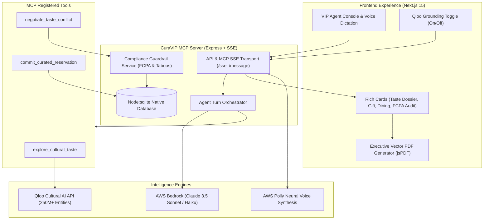

# CuraVIP: Autonomous Cultural Intelligence & High-Ticket Relationship Concierge

[](https://qloo.com)
[](https://modelcontextprotocol.io)
[](https://nodejs.org)
[](https://aws.amazon.com/bedrock)
[](https://nextjs.org)
[](LICENSE)

> *"Why generic AI fails high-ticket relationship management: The Cultural Blindness problem."*
> When dealmakers prepare for critical executive dinners or gift high-net-worth principals, generic LLMs recommend clichés—gold Parker pens, generic scotch, or fruit baskets. **CuraVIP** transforms corporate diplomatic advisory by grounding AI decision-making in **Qloo's Cultural Taste Graph** (250M+ entities across taste domains), orchestrating autonomous curation through the **Model Context Protocol (MCP)** and **AWS Bedrock**.

---

## 🏛️ Executive Summary

In high-stakes diplomacy, private wealth management, and enterprise dealmaking, **cultural alignment is the ultimate leverage**. A gift or dinner venue that reveals deep understanding of an executive's unspoken aesthetic sensibilities cements relationships; an off-taste choice or dietary faux pas destroys trust instantly.

Generic LLMs fail because they optimize for commonality over cultural specificity. **CuraVIP** solves this by bridging cross-domain aesthetic correlations:
- If a partner admires **Christopher Nolan** and **Brutalist Architecture**, CuraVIP understands the underlying theme of *Monumental Precision & Kinetic Tension*, proposing a **Bizen Ceramic Ware Charcoal Vase** or an architectural desk artifact rather than an IMAX gift card.
- If a sovereign wealth principal adheres to **Halal & Zero-Alcohol** principles, CuraVIP's **Compliance Guardrail Engine** strictly excludes all wine/spirits, vetting gifts against **FCPA anti-bribery thresholds ($200 / $500 caps)** and duplicate gifting history.

---

## ⚡ Core Features

### 1. Qloo Cultural Taste Graph Grounding
- **Cross-Domain Correlation Engine**: Discovers non-obvious affinities across cinema, architecture, ambient soundscapes, fine dining, literature, and bespoke craftsmanship.
- **Resilient Fallback Clusters**: Features curated high-fidelity correlation clusters for offline execution and seamless demo reliability.

### 2. The Grounding Toggle ("The Judge-Winning Feature")
- Toggle between **Qloo Grounded Mode** and **Generic LLM Baseline** with one click.
- Experience the dramatic difference side-by-side:
  - **Generic LLM**: Recommends generic Montblanc pens, standard champagne, and steakhouse chains.
  - **Qloo Grounded Concierge**: Delivers provenance-anchored gifts (e.g., bespoke horology book, rare vintage vinyl, artisanal Japanese incense) and private dining salons aligned to the principal's taste profile.

### 3. Standards-Compliant Model Context Protocol (MCP) Server
- Implements MCP SSE (Server-Sent Events) and JSON-RPC transports.
- Exposes three high-value concierge tools:
  - `explore_cultural_taste`: Deep cross-domain affinity analysis via Qloo.
  - `commit_curated_reservation`: Generates VIP reservation orders and concierge specs.
  - `taste_negotiator`: Resolves multi-stakeholder taste conflicts and budget constraints.
- Native MCP Resources: `vip://roster`, `qloo://taste-clusters`, `policy://fcpa-guidelines`.

### 4. FCPA & Taboo Compliance Guardrails
- **Anti-Bribery Audit**: Enforces corporate policy limits ($200 Standard, $500 Executive, Custom VIP) and flags sovereign/state-affiliated risk levels under FCPA.
- **Dietary & Religious Filtering**: Zero-alcohol enforcement, Halal/Kosher/Vegan validation, and animal hide restrictions.
- **Anti-Duplicate History**: Queries previous dossiers to guarantee principals never receive repetitive gifts across business quarters.

### 5. Dark Luxury Aesthetic & Executive Outputs
- **Design System**: Obsidian (`#070709`), Champagne Gold (`#D4AF37`), Slate Glass with specular edge lighting and ambient reactive glow.
- **One-Click Vector PDF Dossier**: Client-side single-page A4 executive briefing generated via `jsPDF`.
- **AWS Polly Neural Voice Briefing**: Hands-free executive voice briefing synthesized using Polly's neural voices (`Ruth` / `Matthew`).

---

## 📐 System Architecture



---

## 🎭 Demo Personas

| Principal | Role & Organization | Explicit Interests | Taboos & Constraints | Curated Outcome |
| :--- | :--- | :--- | :--- | :--- |
| **Marcus Vance** | Managing Partner, Horizon Capital (NYC) | Christopher Nolan, Brutalism, Ambient/Hans Zimmer | Shellfish allergy; $500 cap | Bizen Ceramic Charcoal Vase, private Brutalist salon dinner |
| **Tariq Al-Mansoor** | Founder, Kinetix AI (Riyadh) | Independent Horology, Dieter Rams, Specialty Coffee | **100% Zero-Alcohol**, Halal only | Philippe Dufour Monograph, artisanal cold-drip set, zero-proof pairing |
| **Elena Rostova** | Chief Creative Officer, Maison Vane (Milan) | New Orleans Jazz, Natural Wine, Avant-Garde Fashion | Strict $200 corporate compliance cap | First-press Blue Note vinyl, natural wine salon tasting |

---

## 🚀 Quickstart & Installation

### Prerequisites
- **Node.js**: v22.x or higher (uses native `node:sqlite`)
- **npm**: v10.x or higher

### 1. Clone Repository & Setup Environment
```bash
git clone https://github.com/phonguit22/curavip-agent.git
cd curavip-agent

# Copy environment configuration
cp .env.example .env
```

Configure your `.env` with your Qloo and AWS credentials:
```ini
QLOO_API_KEY=your_qloo_api_key_here
QLOO_API_URL=https://api.qloo.com/v2
AWS_REGION=ap-southeast-2
AWS_ACCESS_KEY_ID=your_aws_key
AWS_SECRET_ACCESS_KEY=your_aws_secret
BEDROCK_MODEL_ID=au.anthropic.claude-haiku-4-5-20251001-v1:0
POLLY_VOICE_ID=Ruth
MCP_PORT=3001
NEXT_PUBLIC_MCP_URL=http://localhost:3001
```
*(Note: If `QLOO_API_KEY` is not provided, CuraVIP seamlessly engages its high-fidelity Taste Graph fallback clusters to ensure zero demo interruption).*

### 2. Install Dependencies
```bash
# Install root, backend, and frontend dependencies
npm run install:all
```

### 3. Run Automated Tests
```bash
npm test
```
*Executes full Vitest suite testing Qloo exploration, budget guardrails, taboo filtering, and MCP tool protocols.*

### 4. Build Monorepo
```bash
npm run build
```

### 5. Launch Development Environment
```bash
# Starts both Backend MCP (port 3001) and Frontend (port 3000)
npm run dev
```
Navigate to `http://localhost:3000` to launch the CuraVIP Executive Suite.

---

## 🧪 Automated Test Suite

CuraVIP includes comprehensive Vitest unit and integration test coverage:

```
✓ tests/qlooTasteExplorer.test.ts (6 tests)
  ✓ exploreCulturalTaste returns cross-domain correlations
  ✓ handles unknown seed entities gracefully with fallback
  ✓ respect category filtering for cinema, dining, literature, fashion
✓ tests/complianceGuardrail.test.ts (7 tests)
  ✓ approves proposals within corporate budget limits
  ✓ flags items exceeding budget ceiling
  ✓ blocks alcoholic proposals for principals with zero-alcohol taboo
  ✓ detects high FCPA risk for state-affiliated/sovereign accounts
  ✓ checks duplicate gift history to prevent repeat gifting
✓ tests/mcpAndAgent.test.ts (6 tests)
  ✓ registers all CuraVIP MCP tools
  ✓ executes commit_curated_reservation tool
  ✓ offline intent parser generates valid executive dossiers
```

---

## 💼 Business & Market Impact

CuraVIP is designed for high-value enterprise accounts:
- **Private Wealth & Family Offices**: Tailoring client hospitality without awkward questionnaire friction.
- **M&A and Investment Banking**: Designing closing dinners and bespoke tombstone gifts rooted in authentic shared culture.
- **Luxury Hospitality & Concierges**: Elevating member experiences with cultural grounding unavailable to standard LLM bots.

---

## 📄 License & Attribution

Built for the **Qloo Agentic AI Hackathon (2026)**.  
Licensed under the [MIT License](LICENSE).
